# 🎟️ EventBooking

### Event Management & Ticket Booking System

EventBooking is a modern full-stack web application that streamlines the process of event management and ticket booking. The platform allows users to discover events, reserve tickets, and download QR code-based digital tickets, while organizers can create and manage events, verify attendees through QR scanning, and monitor event participation.

---
## 🎥 Video Demo
▶️ [Click to watch the Demo](https://drive.google.com/file/d/1IBd58q3EsYwRaPMNyqMqL2DjVuUJBk48/view?usp=drive_link)

## ✨ Features

- 🔐 **Secure User Authentication**
- 🎫 **Online Ticket Booking**
- 📅 **Event Creation & Management**
- 🔍 **Event Discovery & Search**
- 📄 **PDF Ticket Generation**
- 📱 **QR Code-Based Digital Tickets**
- ✅ **Ticket Verification & Attendance Tracking**
- 🎤 **Organizer Dashboard**
- 👤 **Booking History Management**
- 🗄️ **MongoDB Database Integration**
- ⚡ **RESTful API Architecture**
- 🎨 **Responsive User Interface**

---

## 🛠️ Tech Stack

| Category | Technologies |
|----------|-------------|
| Frontend | React, Vite, CSS |
| Backend | Node.js, Express.js |
| Database | MongoDB, Mongoose |
| Authentication | JWT |
| PDF Generation | Puppeteer |
| QR Code | QRCode |

---

## 📸 Screenshots

### Landing Page
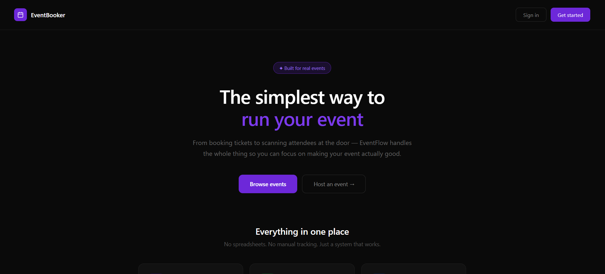

### Authentication
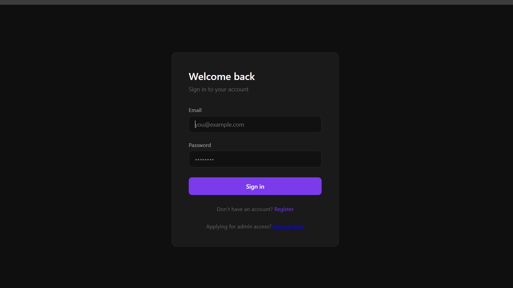

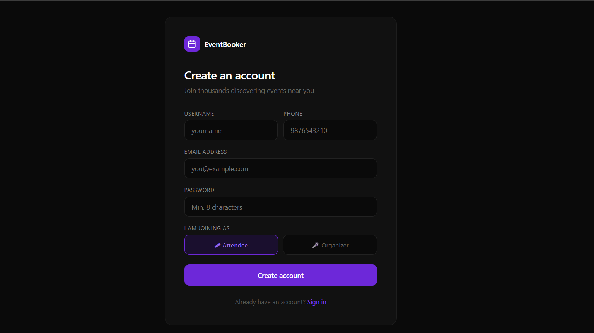

### Discover Events
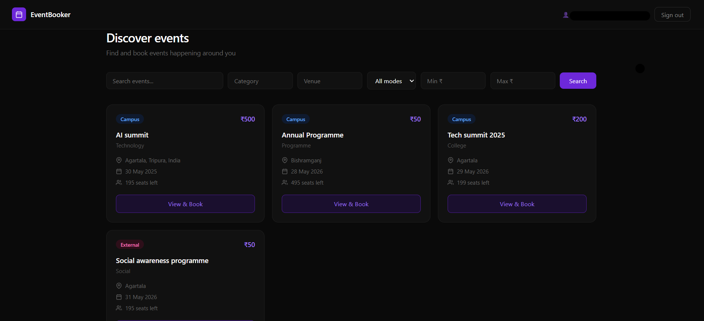

### Event Details
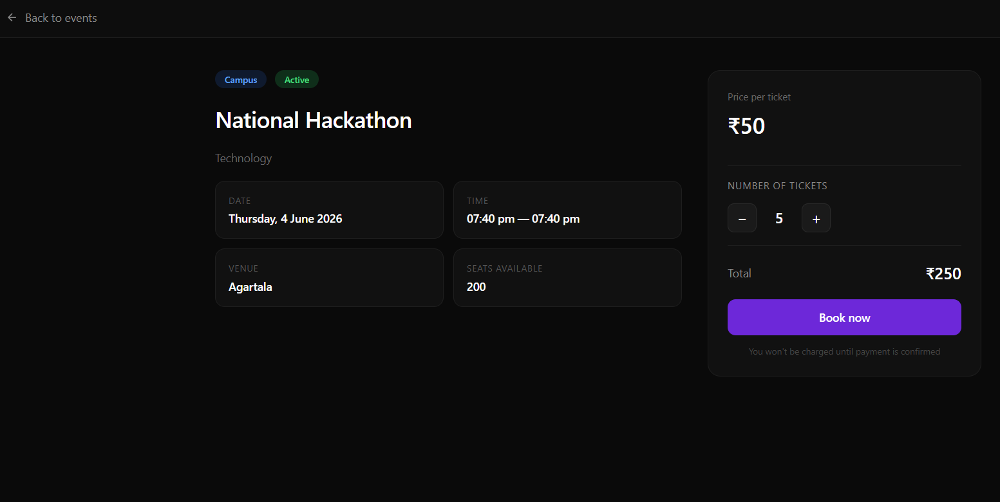

### My Bookings & Tickets
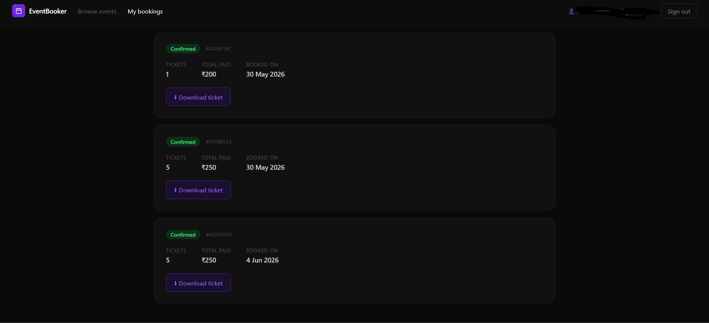

### Organizer Dashboard
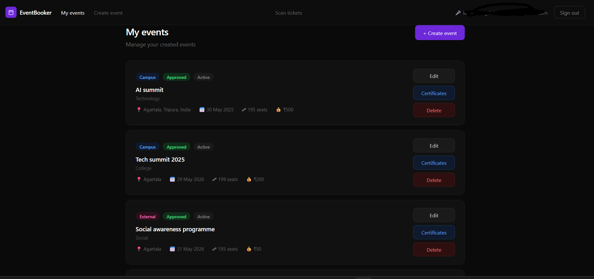

### Create Event
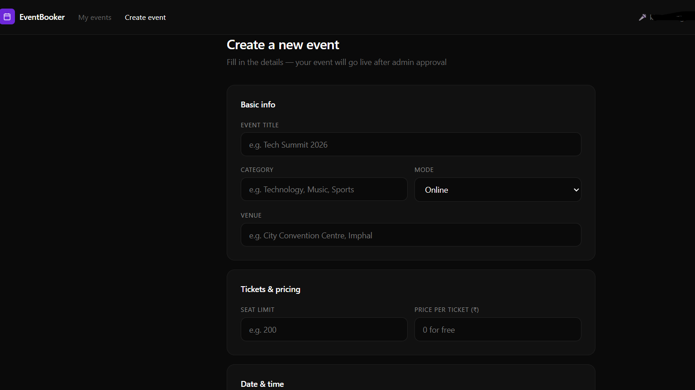

### Scan Tickets
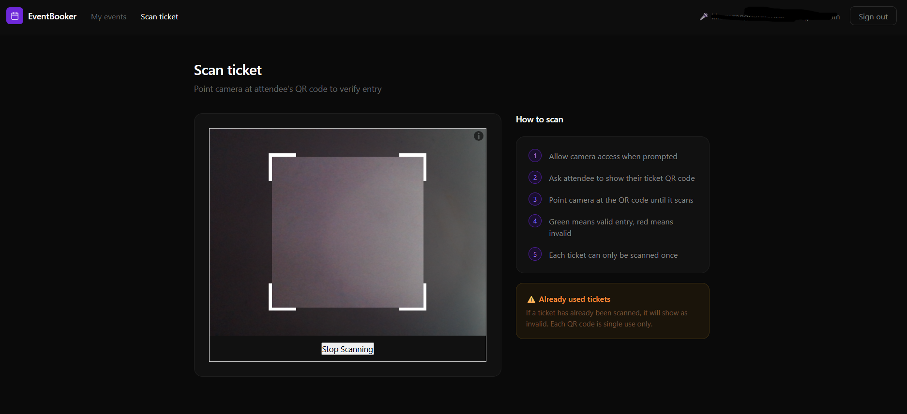

---

## 🏗️ System Architecture

### Architecture Overview
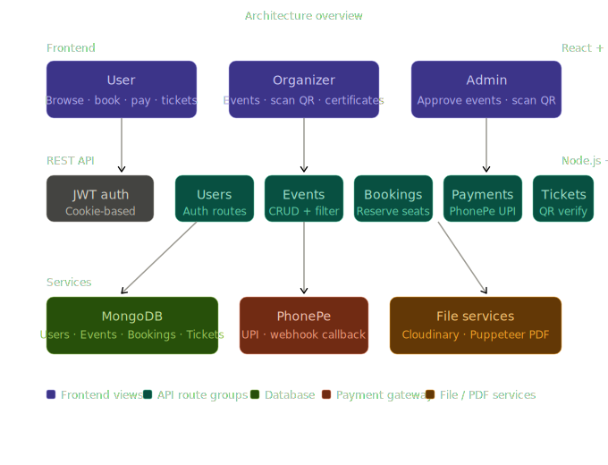


### Booking Workflow

### Attendance & Verification Workflow

---

## 🚀 Getting Started

### Backend

```bash
cd backend
npm install
npm run dev
```

### Frontend

```bash
cd frontend
npm install
npm run dev
```

---

## 📂 Project Structure

```text
EventBooking_System
│
├── backend
│   ├── controllers
│   │   ├── Bookings
│   │   ├── Certificates
│   │   ├── Events
│   │   ├── Tickets
│   │   └── Users
│   ├── db
│   ├── middlewares
│   ├── models
│   ├── routes
│   ├── utils
│   ├── app.js
│   └── index.js
│
├── frontend
│   ├── public
│   ├── src
│   │   ├── api
│   │   ├── assets
│   │   ├── context
│   │   ├── pages
│   │   │   ├── auth
│   │   │   ├── organizer
│   │   │   └── user
│   │   ├── routes
│   │   ├── App.jsx
│   │   ├── App.css
│   │   ├── main.jsx
│   │   └── index.css
│
├── screenshots
├── work flow diagrams
├── README.md
├── package.json
└── .gitignore
```


## 👨‍💻 Development Team

- **Ammar Said Ahmed Elshafey**
- **Mostafa Mohammed Ahmed Mostafa**
- **Nouran Hassan Abdelfatah Elseibaey**
- **Malak Tamer Ahmed Elsheikh**

---

⭐ If you found this project useful, consider giving it a star on GitHub.
